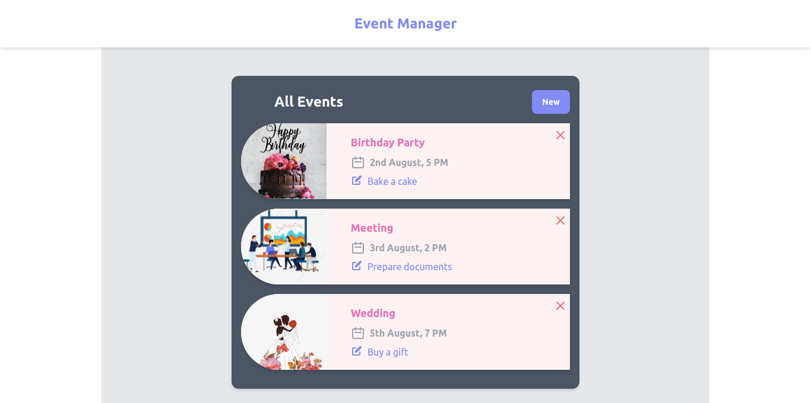
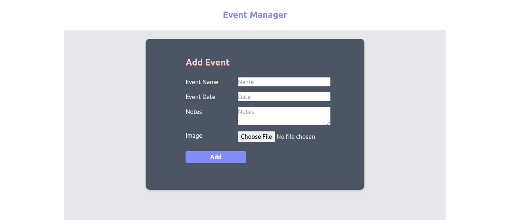
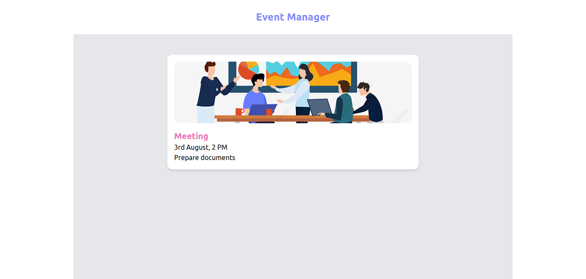

## Event Manager  
 A personal event manager applicationa built with React.js, JavaScript, and Tailwind CSS.

### Project Demo
- Event List

---
- Add Event

---
- Event Detail

### Features
- Show all events
- View event detail page
- Add event
- Delete event

### Installation and Setup Instructions

Clone down this repository. You will need `node` and `npm` installed globally on your machine.  

Installation:

`npm install`  

To Start Server:

`npm start`  

To Visit App:

`localhost:3000`  

